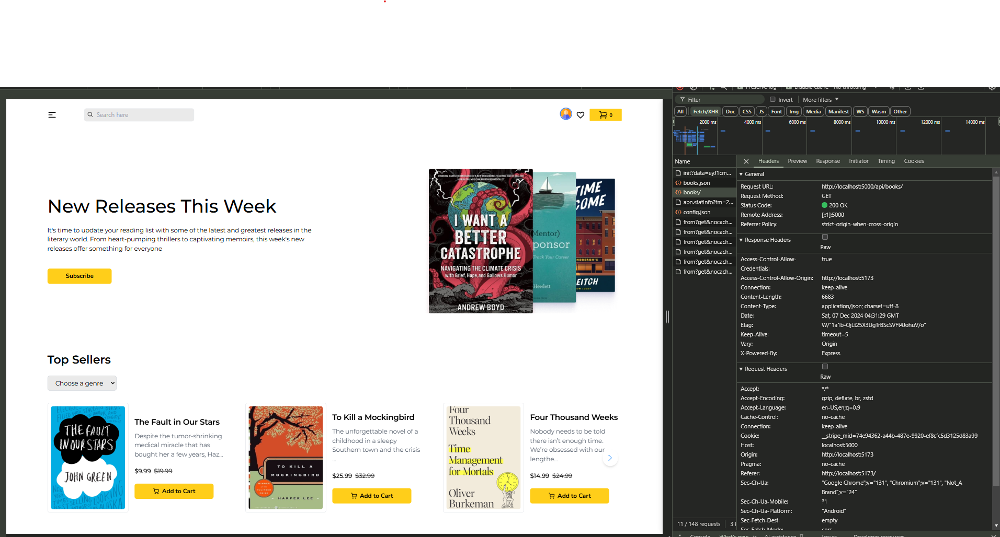

1. Setup client with vite with JS and tailwind.
2. Install react-router-dom and setting up router

-   ` <Outlet/>` - renders the child route elements if it exists

```js
//router.jsx
const router = createBrowserRouter([
    {
        path: "/",
        element: <App />,
        children: [
            {
                path: "/",
                element: <h1>Home</h1>,
            },
        ],
    },
]);

// App.jsx
function App() {
    return (
        <>
            <Outlet />
        </>
    );
}
```

3. Color customization and font customization

```js
//tailwind.config.js
   theme: {
        extend: {
            colors: {
                primary: "#FFCE1A",
                secondary: "#0D0842",
                blackBG: "#F3F3F3",
                Favorite: "#FF5841",
            },
            fontFamily: {
                primary: ["Montserrat", "sans-serif"],
                secondary: ["Nunito Sans", "sans-serif"],
            },
        },
    },
```


```js
function getImageUrl(name) {
    return new URL(`../assets/books/${name}`, import.meta.url);
}

we use import.meta.url, which is a standard way of handling module-relative paths in modern JavaScript.
```

${book?.oldPrice}

-   Optional checking (?)

[Swiper JS](https://swiperjs.com/)

`npm install swiper`

[Navigation](https://swiperjs.com/demos#navigation)
[Response Breakpoints](https://swiperjs.com/demos#responsive-breakpoints)

-   For multi cursor to change click Alt

import news1 from "../../assets/news/news-1.png";
import news2 from "../../assets/news/news-2.png";

Change the name in index.html

```html
<head>
    <meta charset="UTF-8" />
    <link rel="icon" type="image/svg+xml" href="/fav-icon.png" />
    <meta name="viewport" content="width=device-width, initial-scale=1.0" />
    <title>Book Store App</title>
</head>
```

Use static files in public folder, so can easily access here like this.
href="/fav-icon.png"

[React Hook Form](https://react-hook-form.com/get-started)

`npm install react-hook-form`

[Redux Toolkit](https://redux-toolkit.js.org/introduction/getting-started)

```js
const handleAddToCart = (product) => {
    dispatch(addToCart(product));
};

<button
    onClick={() => handleAddToCart(book)}
>

TO WITHOUT USE handleAddToCart,

onClick={() => dispatch(addToCart(book))}

```

TO get Count of Items in NavBar, useSelect

```js
const cartItems = useSelector((state) => state.cart.cartItems);

//Format
`state.nameOfSlice.initialStateNameWithin`;
```

[Sweet Alert](https://sweetalert2.github.io/)

`npm install sweetalert2`

//main.js
import "sweetalert2/dist/sweetalert2.js";

// NavBar.js
import Swal from "sweetalert2";

Keynote:

Key difference:

onClick={handleClearCart}: Works because the function doesn’t need arguments and can be directly passed as a reference.
onClick={() => handleRemoveFromCart(item)}: Required when you need to pass arguments to the function during the button click.

# Backend

Initialize backend here
[ExpressJS](https://expressjs.com/en/starter/installing.html)
[Nodemon](https://www.npmjs.com/package/nodemon)

-   npm install --save-dev nodemon (nodemon as a development dependency)

[Mongoose](https://mongoosejs.com/docs/index.html)
[Dotenv](https://www.npmjs.com/package/dotenv)

mongodb+srv://<uname>:<pwd>@cluster0.bvmvj.mongodb.net/<db-name>?retryWrites=true&w=majority&appName=Cluster0

-   need to define db after put the url

-   # This is a comment
    SECRET_KEY=YOURSECRETKEYGOESHERE # comment
    SECRET_HASH="something-with-a-#-hash"
    Comments begin where a # exists, so if your value contains a # please wrap it in quotes. This is a breaking change from >= v15.0.0 and on.

After set the db, have to give the network as anywhere.

[Cors](https://www.npmjs.com/package/cors)

The express. json() function is a built-in middleware in Express that is used for parsing incoming requests with JSON payload. The express. json middleware is important for parsing incoming JSON payloads and making that data available in the req.

In a nutshell, we are sending form data from frontend to backend, to receive the data in the backend, we use req.body right. to receive those data in req.body we need to pass this json payload

Working flow:

-   define the model, route and use in the server.js

*   To create the product(post request),
    -   Pass the data(come through req.body) to Model (Book({..req.body}))
    -   save the newBook to db (https://mongoosejs.com/docs/documents.html)
    -   res.statusCode.send() / res.statusCode.json()

### res.send() vs res.json()

**res.send()** - The res.send() function is used for sending the response for the HTTP request. It takes a parameter body. The parameter can be a String, Buffer object, an object, Boolean, or an Array.

Syntax:
`res.send( [body] )`
Parameter: The body parameter takes a single argument that describes the body that is to be sent in the response.

Content Type: The Express sets the content type of the parameter according to the type of the body parameter.

String & HTML - “text/html”
Buffer - “application/octet-stream”
Array & object - "application/json"
Return Type: It is used to send a response to the client and then ends the response process. The method itself doesn't return anything.

**res.json()** - The res.json() function sends the response as JSON format. It automatically converts the JavaScript object into a JSON-formatted string. The parameter body can be of any JSON type, which includes object, array, string, Boolean, number, or null.

res.json() will also convert non-objects, such as null and undefined, which are not valid JSON.

Syntax:
`res.json( [body] )`
Parameter: The body parameter takes JavaScript Object as its argument.

Content Type: Its content-type is set to - "application/json".

Returns: It is used to send JSON response to the client and then ends the response process.

Inorder to maintain MVC structure, moving the route async function into controller

-   Methods of mongoose (https://mongoosejs.com/docs/queries.html)

After creating the controller, in the frontend we fetch the bookData from json file and we need to fetch from API using Redux toolkit inorder to be dynamic.
[Redux vs Redux toolkit](https://30dayscoding.com/blog/redux-vs-redux-toolkit)

## [Redux toolkit](https://redux-toolkit.js.org/introduction/getting-started)

[RTK Query](https://redux-toolkit.js.org/rtk-query/overview)

Based on the documentation,
we can capture the things, and how that works.

[fetchBaseQuery](https://redux-toolkit.js.org/rtk-query/api/fetchBaseQuery)

```js
if you are using,
`export const <nameOfFunc>`

`import {nameofFunc} from "../"`

but in default export function,
`import nameOfFunc from "../"`
```

**In Slice**
`builder.query()` - To get

`builder.mutation()` - To update, edit

**In frontend to use those**
return types

-   {} - for query
-   [] - for mutation



```js
    addBook: builder.mutation({
        query: (newBook) => ({
            url: `/create-book`,
            method: "POST",
            body: newBook,
        }),
        // when we add this it will refetch the getAllBooks and will include
        invalidatesTags: ["Books"],
    }),
```

Then to select particular book, useFetchByIdQuery.

# [Setup Firebase for login](https://firebase.google.com/)

-   Get Started
-   Create a new project
-   install firebase in frontend
-   create config file and paste the config (firebase/firebase.config.js)
-   import getAuth from firebase and export the config as below line
-   `export const auth = getAuth(app)`

-   create .env in frontend and add the credentials of firebase within it
    [Env Vite](https://vite.dev/guide/env-and-mode)

    ```
    // .env.local
    VITE_apiKey = xxxx
    console.log(import.meta.env.VITE_apiKey) // to get output
    ```

    ```js
    VITE_apiKey = xxxx;
    //CTRL +shift + p => type transform to uppercase
    VITE_APIKEY = xxxx;
    ```

    ```js
    const firebaseConfig = {
        apiKey: import.meta.env.VITE_API_KEY,
        authDomain: import.meta.env.VITE_Auth_Domain,
        projectId: import.meta.env.VITE_PROJECT_ID,
        storageBucket: import.meta.env.VITE_STORAGE_BUCKET,
        messagingSenderId: import.meta.env.VITE_MESSAGING_SENDER_ID,
        appId: import.meta.env.VITE_APP_ID,
    };
    ```

-   Then in firebase, go to console.

Project Overview -> Project Settings -> General (Can see the credentials and info)

-   Build -> Authentication -> Get Started ->
-   Sign in method -> provider -> Email and pwds, Google
    (Use the provider whatever you want)

## After done this, you have to setup the Context state like Login state, logout state, registration state and current user state using **Context API**

create file context/AuthContext.jsx

```js
const AuthContext = createContext();

// we will check the user available in context or not
export const useAuth = () => {
    return useContext(AuthContext);
};
```

If we use Context, we must use provider.

```js
import { createContext, useContext } from "react";

// creating context for Auth
const AuthContext = createContext();

// use that context
export const useAuth = () => {
    return useContext(AuthContext);
};

// we must provide a provider for the context
export const AuthProvider = ({ children }) => {
    const value = {};

    return (
        <AuthContext.Provider value={value}>
            // we must pass this children to props inorder pass the component
            {children}
        </AuthContext.Provider>
    );
};
```

Then wrap up the main file with Provider

```js
function App() {
    return (
        <>
            <AuthProvider>
                <Navbar />
                <main className="min-h-screen max-w-screen-2xl mx-auto px-4 py-8 font-primary">
                    <Outlet />
                </main>
                <Footer />
            </AuthProvider>
        </>
    );
}
```

## Login and Logout functionality

-   define current user and loading func
-   define reg user function

```
export const AuthProvider = ({ children }) => {
    const [currentUser, setCurrentUser] = useState(null);

    // will check if loading or not
    const [isLoading, setUseLoading] = useState(true);

    // register user
    const registerUser = async () => {};

    const value = {
        currentUser
    };

    return (
        <AuthContext.Provider value={value}>{children}</AuthContext.Provider>
    );
};
```

[Auth of firebase](https://firebase.google.com/docs/auth/web/start)

-   define register user

```
import { auth } from "../firebase/firebase.config";


// register user
    const registerUser = async (email, password) => {
        return await createUserWithEmailAndPassword(auth, email, password);
    };

// to use context within we need to pass reg user here
    const value = {
        currentUser,
        registerUser
        };

```

Then in the Register.jsx

-   gonna use registerUser, for that useAuth.

        `

    import { useAuth } from "../context/AuthContext";
    const { registerUser } = useAuth(); // use { } destructering(not array) bcz we pass that into value within object
    `

```js
import { useAuth } from "../context/AuthContext";

const Register = () => {
    const [message, setMessage] = useState("");

    const { registerUser } = useAuth();

    % const {
    %     register,
    %     handleSubmit,
    %     watch,
    %     formState: { errors },
    % } = useForm();

    const onSubmit = async (data) => {
        console.log(data);
        try {
            // use await here for the response
            await registerUser(data.email, data.password);
            alert("User registered successfully");
        } catch (error) {
            setMessage("Please provide a valid email and password");
            console.error(error);
        }
    };
};
```

-Login user

```js
//Authcontext.

//login user
const loginUser = async (email, password) => {
    return await signInWithEmailAndPassword(auth, email, password);
};

const value = {
    currentUser,
    registerUser,
    loginUser,
};
```

```
//Login.jsx

const Login = () => {
    const [message, setMessage] = useState("");
    const { loginUser } = useAuth();
    const navigate = useNavigate();

    const {
        register,
        handleSubmit,
        watch,
        formState: { errors },
    } = useForm();

    const onSubmit = async (data) => {
        // console.log(data);
        try {
            await loginUser(data.email, data.password);
            alert("Logged in successfully");
            navigate("/");
        } catch (error) {
            setMessage("Please provide a correct email and password");
            console.error(error);
        }
    };}

```

## Adding 3 ways of log

```javascript
export const AuthProvider = ({ children }) => {
    const [currentUser, setCurrentUser] = useState(null);
    const [isLoading, setUseLoading] = useState(true);

    // register user
    const registerUser = async (email, password) => {
        return await createUserWithEmailAndPassword(auth, email, password);
    };

    //login user
    const loginUser = async (email, password) => {
        return await signInWithEmailAndPassword(auth, email, password);
    };

    // signin with google
    const signInWithGoogle = async () => {
        return signInWithPopup(auth, googleProvider);
    };

    const value = {
        currentUser,
        registerUser,
        loginUser,
        signInWithGoogle,
    };

    return (
        <AuthContext.Provider value={value}>{children}</AuthContext.Provider>
    );
};
```

```js
//login.
// Same as for register.jsx as well

const { loginUser, signInWithGoogle } = useAuth();

const handleGoogleSignIn = async () => {
    try {
        await signInWithGoogle();
        alert("Logged in successfully");
        navigate("/");
    } catch (error) {
        alert("Failed to login with Google");
        console.error(error);
    }
};
```

// [logout](https://firebase.google.com/docs/auth/web/password-auth)

```js
// logout
const logout = () => {
    return signOut(auth);
};
```

Now have to manage the state with login and logout [Manage Users](https://firebase.google.com/docs/auth/web/manage-users)

-   OnAuthStateChanged -> Using this can manage users data and observer

```js
// manage user
useEffect(() => {
    const unsubscribe = onAuthStateChanged(auth, (user) => {
        setCurrentUser(user);
        setLoading(false);
        const { email, displayName, photoURL } = user;
        const userData = {
            email,
            username: displayName,
            photo: photoURL,
        };
    });

    return () => unsubscribe();
}, []);
```

-   define currentUser and logout in navbar

```js
// Navbar.jsx

const { currentUser, logout } = useAuth();

const handleLogout = () => {
    logout();
};
------
<div className="absolute right-0 mt-2 w-48 bg-white shadow-lg rounded-md z-40">
    <ul className="py-2">
        {navigation.map((item) => (
            <li key={item.name} onClick={() => setIsDropdownOpen(false)}>
                <Link
                    to={item.href}
                    className="block px-4 py-2 text-sm hover:bg-gray-100"
                >
                    {item.name}
                </Link>
            </li>
        ))}
        // New func
        <li>
            <button
                className="block px-4 py-2 w-full text-left text-sm hover:bg-gray-100"
                onClick={handleLogout}
            >
                Logout
            </button>
        </li>
    </ul>
</div>;
```

-   When we try to checkout, the user should be sign in (Protective routes)
-   Create protectedRoute file and give the logic
    -   Retrieve current user information
    -   check if the user is there already
    -   if there return children or navigate to /login
    -   Then add protected route wrap for checkout route
    -   rewrite the logic in checkoutPage.jsx > getting current user

---

-   Create Order model with the help of checkoutPage.jsx
-   route and controller as well.
    -   when creating controller, we directly get the content from req.body
-   then define in server.js

Summary

-   createApi helps set up a way to talk to the server.
-   reducerPath names the storage box for API data.
-   baseQuery sets up the basic request details.
-   baseUrl is the starting address for requests.
-   credentials includes cookies in requests.
-   tagTypes helps track and update data.
-   endpoints defines actions we can do, like creating an order.
-   createOrder sets up the details for creating a new order.
-   invalidatesTags tells us to refresh the order list after creating a new order.

NOTE:

const [createOrder, {isLoading, error}] = useCreateOrderMutation();

const { data: books = [] } = useFetchAllBooksQuery();

**What is useCreateOrderMutation?**

-   useCreateOrderMutation is a hook from Redux Toolkit Query that helps you create a new order. When you use this hook, it gives you two things:

    1. A function to create the order.
    2. An object with information about the request, like if it's loading or if there was an error.

**What is useFetchAllBooksQuery?**

-   useFetchAllBooksQuery is another hook from Redux Toolkit Query that helps you fetch a list of books. When you use this hook, it gives you an object with the data and other information.

**Why is One an Array and the Other an Object?**
**useCreateOrderMutation**
When you use useCreateOrderMutation, it returns an array with two items:

    1. The function to create the order.
    2. An object with information about the request.

You can think of it like this:

-   The first item in the array is the action you can do (create an order).
-   The second item is the status of that action (is it loading, is there an error).
    Here’s how you use it:

    `const [createOrder, { isLoading, error }] = useCreateOrderMutation();`

createOrder is the function you call to create an order.
{ isLoading, error } is an object with information about the request.

**Unwraps a mutation call to provide the raw response/error.**

@remarks — If you need to access the error or success payload immediately after a mutation, you can chain .unwrap().

@example

```
addPost({ id: 1, name: 'Example' })
.unwrap()
.then((payload) => console.log('fulfilled', payload))
.catch((error) => console.error('rejected', error));
```

When we refresh privateRoute it redirect to login. for that have to add loading...

```javascript
const PrivateRoute = ({ children }) => {
    const { currentUser, loading } = useAuth();
    // console.log("Protected Route, currentUser: ", currentUser);

    // must use return here otherwise no use
    if (loading) {
        return <div>Loading....</div>;
    }
    if (currentUser) {
        return children;
    }
    return <Navigate to="/login" replace />;
};
```

## Admin Creation and dashboard

Before save userSchema, there is multiple methods. here we need to secure the pw using bcrypt. for that purpose

For user,
[Bcrypt](https://www.npmjs.com/package/bcrypt)
[JSON Web token](https://www.npmjs.com/package/jsonwebtoken)
[Mongoose and bcrypt ](https://medium.com/@finnkumar6/mastering-user-authentication-building-a-secure-user-schema-with-mongoose-and-bcrypt-539b9394e5d9#:~:text=By%20using%20Mongoose%20in%20conjunction,flexibility%20and%20scalability%20of%20MongoDB.)

create model, route and controller for user

```js
// Presave hook for password hashing
userSchema.pre("save", async function (next) {
    // check if the password has been modified
    if (!this.isModified("password")) return next();

    // Generate the hash salt and hash password
    this.password = await bcrypt.hash(this.password, 10);
    next(); // Proceed to save
});
```

### To generate random key

-   type node enter->
-   crypto.randomBytes(64).toString("hex")

## Create admin user with token

[JWT IO](https://jwt.io/)

```js
router.post("/admin", async (req, res) => {
    const { username, password } = req.body;
    try {
        const admin = await User.findOne({ username });
        if (!admin) {
            res.status(404).send({ message: "Admin not found" });
        }
        if (admin.password !== password) {
            res.status(401).send({ message: "Invalid password" });
        }

        // sending pwd in payload is bad practice. even it hashed, bcz payload is encoded not encrypted
        // { id: admin._id, password: admin.password, role: admin.role },

        const token = jwt.sign(
            { id: admin._id, role: admin.role },
            JWT_SECRET,
            {
                expiresIn: "1h",
            }
        );

        return res.status(200).json({
            message: "Authentication successful",
            token: token,
            user: {
                username: admin.username,
                role: admin.role,
            },
        });
    } catch (error) {
        console.error("Failed to login as admin", error);
        res.status(500).json({ message: "Failed to login as admin" });
    }
});
```

Then verify that actually the token is tampered with something and check the validity of the token

```javascript
const verifyAdminToken = (req, res, next) => {
    const token = req.headers["authorization"]?.split(" ")[1];
    if (!token) {
        return res
            .status(401)
            .json({ message: "Access Denied, no token provided." });
    }
    jwt.verify(token, JWT_SECRET, (err, user) => {
        if (err) {
            return res.status(403).json({ message: "Invalid credentials" });
        }
        // we add the decoded user to the req.user [for convention (err, decoded) , req.user = decoded]
        req.user = user;
        next();
    });
};
```

[HTTP Authorization Header](https://beeceptor.com/docs/concepts/authorization-header/#:~:text=The%20Authorization%20header%20is%20a,credentials%20like%20username%20and%20password.)

```javascript
jwt.verify(token, "shhhhh", function (err, decoded) {
    if (err) {
        /*
      err = {
        name: 'TokenExpiredError',
        message: 'jwt expired',
        expiredAt: 1408621000
      }
    */
    }
});
```

Then add the verifyAdminToken to create a new book, so admin can only create a book. edit and dlt as well.

```js
router.post("/create-book", verifyAdminToken, createBook);

router.get("/", getAllBooks);

router.get("/:id", getSingleBook);

router.put("/edit/:id", verifyAdminToken, updateBook);

router.delete("/:id", verifyAdminToken, deleteBook);
```

**Test in postman**
So have to pass the token in Auth
Auth Type: Bearer Token
Token: pass the token here

## Create /dashboard in frontend

```js
{
        path: "/dashboard",
        element: <div>Dashboard</div>,
        children: [
            {
                path: "add-new-book",
                element: <div>Dashboard Home</div>,
            },
            {
                path: "/add-new-book",
                element: <div>Add New Book</div>,
            },
        ]
}

Here when you add /
1. Relative path
    - This path is relative to the parent route (/dashboard).
    - When the user navigates to /dashboard/add-new-book, this route will match because the path automatically appends to the parent.

2. Absolute path ( from the root)
    - This path is absolute, meaning it starts from the root (/) of the application.
    - It will match only /add-new-book, not /dashboard/add-new-book, even though it’s nested under /dashboard in the route configuration.
```

### Admin Route

Let’s Turn It Into a Story

-   Imagine you’re visiting a secret treehouse (admin pages) that only special people can enter.
-   At the treehouse entrance, there’s a guard (AdminRoute) who checks if you have the secret password (token).
-   If you don’t have the password:
    The guard says, “You can’t enter! Go back to the gate to get the password!” (redirects to /admin).
-   If you have the password:
    The guard says, “Welcome in! You can go to the treehouse room you’re looking for!” (shows the children or page).

What Do the Parts Mean?

-   children: This is the content or page the user wants to see (like the admin dashboard).
-   Example: If the admin dashboard is inside this route, it will show the dashboard when the guard lets you in.

localStorage.getItem("token"): This is where the browser keeps the secret key (token) for logged-in users.

<Navigate to="/admin" />: This is the guard saying, “Go to the login page.”

<Outlet />: This is a placeholder that will display whatever nested pages are set up for this route.

## LocalStorage vs Session Storage vs Cookies

1. localStorage

    - Definition: A web storage API that allows storing key-value pairs in the browser with no expiration date.
    - Storage Limit: 5-10 MB (varies by browser).
    - Scope: Stored data persists even after the browser is closed and reopened.
    - Accessibility: Accessible only within the same origin (protocol, domain, and port).
    - Use Cases:
        - Storing user preferences (e.g., theme, language).
        - Saving form data for auto-fill functionality.
        - Caching data for offline access.

2. sessionStorage

-   Definition: Similar to localStorage but data persists only for the duration of the page session.
-   Storage Limit: 5-10 MB (varies by browser).
-   Scope: Data is cleared when the browser tab or window is closed.
-   Accessibility: Accessible only within the same tab and origin.

    -   Use Cases:

    -   Temporary data storage for a single tab or session (e.g., form inputs).
    -   Storing data that should not persist after the session ends.
    -   State management for multi-step forms.

3. Cookies

-   Definition: Small pieces of data stored on the client-side, typically used for storing and sending information between the client and server.
-   Storage Limit: 4 KB per cookie (including name, value, and metadata).
-   Scope: Can be accessed server-side via HTTP headers or client-side via JavaScript.
-   Expiry: Can have a set expiration date or be cleared when the browser is closed (session cookies).
-   Security: Can be made secure using the Secure and HttpOnly flags.
-   Use Cases:

    -   Authentication tokens (e.g., JWTs or session IDs).
    -   User tracking and analytics.
    -   Storing small pieces of information to send to the server with each request.

---

### Comparison Table

| Feature         | **localStorage**                    | **sessionStorage**                  | **Cookies**                                    |
| --------------- | ----------------------------------- | ----------------------------------- | ---------------------------------------------- |
| **Capacity**    | 5-10 MB                             | 5-10 MB                             | ~4 KB per cookie                               |
| **Lifetime**    | Persistent                          | Session-only                        | Depends on expiration date                     |
| **Scope**       | Same-origin, across tabs            | Same-origin, single tab             | Sent with HTTP requests                        |
| **Access**      | Client-side only                    | Client-side only                    | Server and client                              |
| **Security**    | Relatively insecure (no encryption) | Relatively insecure (no encryption) | More secure with `HttpOnly` and `Secure` flags |
| **Performance** | Fast access (local JS)              | Fast access (local JS)              | Slightly slower (sent with HTTP requests)      |

### Set the Admin Login Page and connect with Server to verify the Admin

//AdminLogin.jsx

```javascript
const onSubmit = async (data) => {
    // console.log(data);

    try {
        const response = await axios.post(
            `${getBasicUrl()}/api/auth/admin`,
            data,
            {
                headers: {
                    "Content-Type": "application/json",
                },
            }
        );

        const auth = response.data;
        console.log(auth);
        if (auth.token) {
            localStorage.setItem("token", auth.token);
            setTimeout(() => {
                localStorage.removeItem("token");
                alert("Token has been expired, please login again");
                navigate("/");
            }, 3600 * 1000);
        }

        alert("Admin login successful");
        navigate("/dashboard");
    } catch (error) {
        setMessage("Please provide a correct email and password");
        console.error(error);
    }
};
```

Set the headers while Sending the data,
In the Admin route, where we receive and verify for the particular route

### To admin dashboard,

## (Server side)

// states/admin.stats.js

```js
const mongoose = require("mongoose");
const express = require("express");
const Order = require("../orders/order.model");
const Book = require("../books/book.model");
const router = express.Router();

// Function to calculate admin stats
router.get("/", async (req, res) => {
    try {
        // 1. Total number of orders
        const totalOrders = await Order.countDocuments();

        // 2. Total sales (sum of all totalPrice from orders)
        const totalSales = await Order.aggregate([
            {
                $group: {
                    _id: null,
                    totalSales: { $sum: "$totalPrice" },
                },
            },
        ]);

        // 4. Trending books statistics:
        const trendingBooksCount = await Book.aggregate([
            { $match: { trending: true } }, // Match only trending books
            { $count: "trendingBooksCount" }, // Return the count of trending books
        ]);

        // If you want just the count as a number, you can extract it like this:
        const trendingBooks =
            trendingBooksCount.length > 0
                ? trendingBooksCount[0].trendingBooksCount
                : 0;

        // 5. Total number of books
        const totalBooks = await Book.countDocuments();

        // 6. Monthly sales (group by month and sum total sales for each month)
        const monthlySales = await Order.aggregate([
            {
                $group: {
                    _id: {
                        $dateToString: { format: "%Y-%m", date: "$createdAt" },
                    }, // Group by year and month
                    totalSales: { $sum: "$totalPrice" }, // Sum totalPrice for each month
                    totalOrders: { $sum: 1 }, // Count total orders for each month
                },
            },
            { $sort: { _id: 1 } },
        ]);

        // Result summary
        res.status(200).json({
            totalOrders,
            totalSales: totalSales[0]?.totalSales || 0,
            trendingBooks,
            totalBooks,
            monthlySales,
        });
    } catch (error) {
        console.error("Error fetching admin stats:", error);
        res.status(500).json({ message: "Failed to fetch admin stats" });
    }
});

module.exports = router;
```

Define routes in server.js as well.

`const adminRoutes = require("./src/stats/admin.stats");
app.use("/api/admin", adminRoutes);`

Install

```bash
npm i react-chartjs-2 chart.js
```

[Chart JS 2](https://www.npmjs.com/package/react-chartjs-2)
[Chart.JS](https://www.chartjs.org/docs/latest/)
